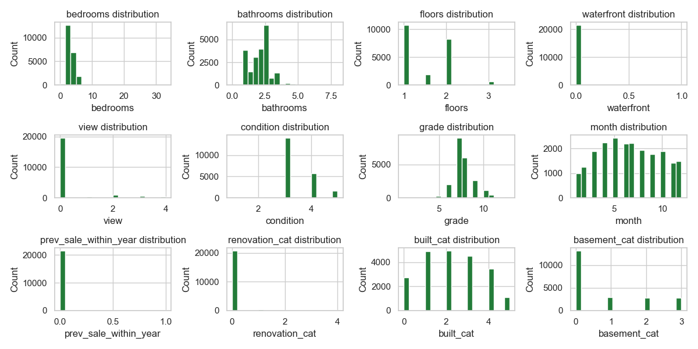
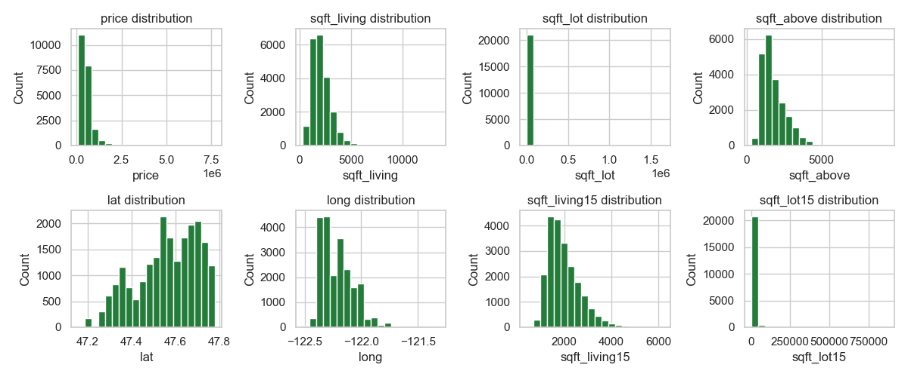
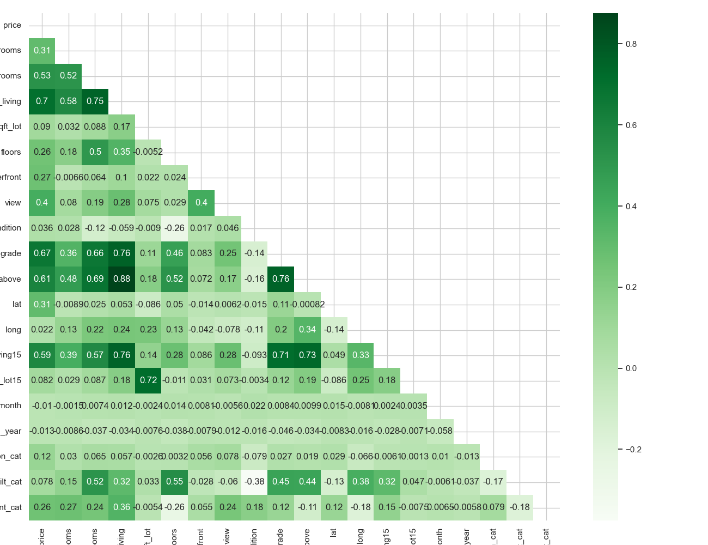
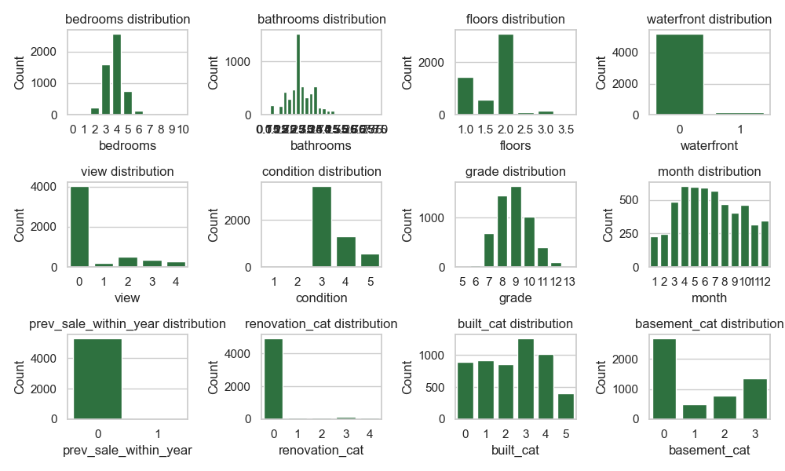
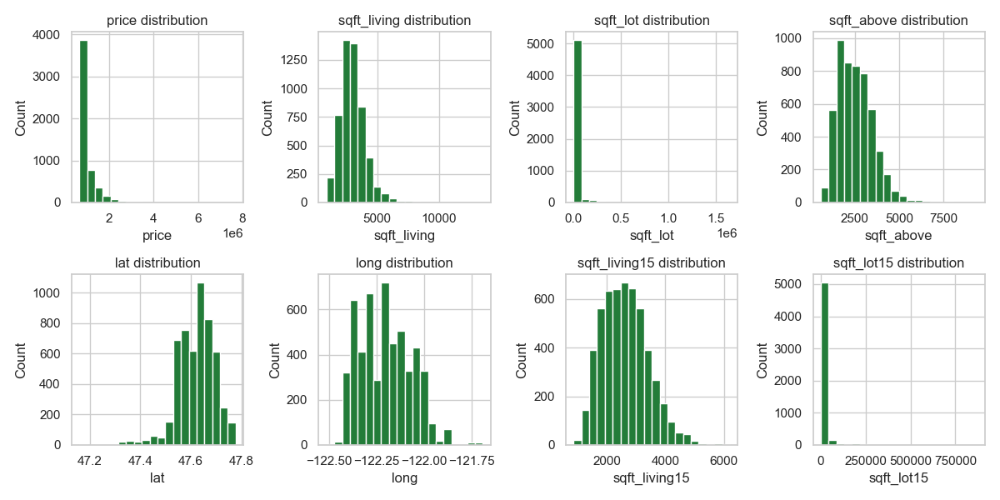
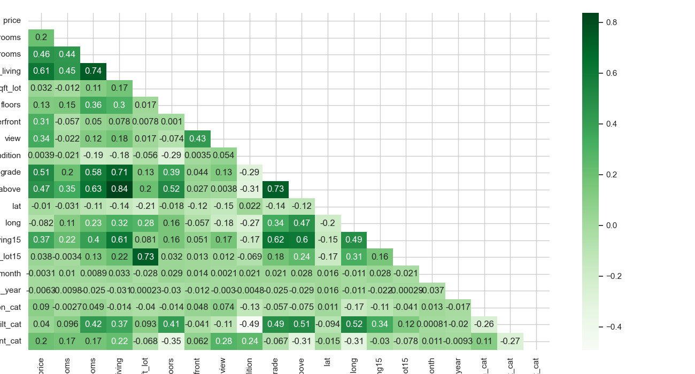

## Overview

\tableofcontents

# Introduction

- dataset from property sales in King County, Seattle, WA, USA
- timeframe: between May 2014 and May 2015 
- source: <https://www.kaggle.com/datasets/minasameh55/king-country-houses-aa>

### Aims

- predict sales prices based on dataset
- (closer look at subset of data with `price` $\geq$ \$650k)

# EDA

## Overview

- 21 613 datarows
- 21 columns
- descriptions in meta-data, but some clarifications
  - grade up to 13 (instead of 11)
  - views 0--4 (instead of binary)
  - id identifies properties not transactions
- target variable `price`
  - range: 75k--7700k
  - mean: 540088,14
  - median: 450k
  - right-skewed

## Pre-processing and feature engineering

- no missing values`
- duplicates for `id` explained by multiple sales of same property
  - created new column `prev_sale_within_year`
- extracted month and day (as `int`s) from `date`
- later:
  - drop zipcode
  - drop day

## Transforming data 

- transformed following data into categorial:
  - `yr_renovated`
  - `yr_built`
  - `sqft_basement`
- two variants:
  - labels
  - one-hot-encoding
  
## Scaling

- kept a version of unscaled data
- scaling using `sklearn.compose.ColumnTransformer`
  - apply StandardScaler to continuous columns
  - pass through categorial variables unchanged

## Distributions

## Barplots for categorial data

{ height=80% }

## Histograms for continuous data

{ height=80% }

## Correlation matrix

{ height=80% }

# Implementation aspects

## Helper functions

- `mk_histplots`: generate histplots for a (subset of a) dataframe, optionally saving output
- `mk_barplots`: generate countplots for a (subset of a) dataframe, optionally saving output
- `mk_boxplots`: generate barplots for a (subset of a) dataframe, optionally saving output
- `plot_corrmatrix`: plot a correlation matrix for a dataframe, optionally saving output
- evaluation function
- function for plotting coefficients in linear models

# Model comparison

## Overall approach

- running different models including some hyper-feature tuning
  - Linear Regression Models
  - KNN
  - GradientBoost
  - RandomForests
  - XGBRegressor
- evaluation function printing for training and test sets:
  - r²-score
  - adjusted r²-score (penalising models with more features)
  - mean-squared-errors
  - mean-absolute-errors
  - ratio of MAE to maximum target value
- evaluation function returns adj. r² and MAE for training and test for collection in dataframes 

## Data collection

- lists for each model family transformed into DataFrame
- sorted by adj. r² and MAE for test sets
- top 3 for each family included in an overall list

## Results

\dummy{
\small
\begin{tabular}{lrrrrrr}
\toprule
type & scaled & $r^{2}$-a-train & $r^{2}$-a-test & mae-train & mae-test \\
\midrule
XGBoost & False & 0.975 & 0.913 & 40600.868 & 65516.939 \\
XGBoost & False & 0.975 & 0.913 & 40600.871 & 65516.938 \\
XGBoost & False & 0.975 & 0.913 & 40600.864 & 65516.941 \\
GradientBoost & True & 0.998 & 0.908 & 3511.192 & 64412.386 \\
GradientBoost & True & 0.996 & 0.906 & 5168.707 & 64658.581 \\
GradientBoost & True & 0.993 & 0.905 & 10322.906 & 63306.014 \\
RandomForests & True & 0.980 & 0.879 & 30229.928 & 71517.825 \\
RandomForests & True & 0.980 & 0.879 & 30229.928 & 71517.825 \\
RandomForests & True & 0.980 & 0.877 & 30653.158 & 72256.111 \\
knn & True & 0.818 & 0.787 & 86150.484 & 95555.056 \\
knn & True & 0.829 & 0.783 & 84326.308 & 97208.734 \\
knn & True & 0.838 & 0.782 & 82691.138 & 97932.769 \\
lm-lasso & True & 0.704 & 0.684 & 125477.227 & 126751.772 \\
lm-lasso & True & 0.704 & 0.684 & 125477.227 & 126751.772 \\
lm-lasso & True & 0.704 & 0.684 & 125477.226 & 126751.891 \\
\bottomrule
\end{tabular}
}

## Hyperparameters of best performing model 

**XGBoost**

- estimators: 1.0
- booster: gbtree
- subsample: 1
- `dart_nominalized_type`: TREE
- `min_child_weight`: 1.0
- `max_depth`: 6.0
- `reg_alpha`: 0.3
- `reg_lambda`: 1.0
- learning rate: 0.3
- `max_iterations`: 20.0

# Over $650k

##

- much smaller dataset (5324 datapoints)

## Barplots for categorial data

{ height=80% }

## Histograms for continuous data

{ height=80% }

## Correlation matrix

{ height=80% }

## Model fitting

- fit XGBoost on unscaled data using label encoding with a range of hyperparameters 
- best result:
  - $r^2$-adjusted (train): 0.990268
  - $r^2$-adjusted (test): 0.761220
  - MAE (train): 33374.973380
  - MAE (test): 132851.792547
- strong overfitting

# Conclusion/outlook

## 

- more cleanup
- visualising results would be nice
- using RFE (?) to consider rank of features
- GridSearchCV instead of manual looping?
- idea for lat/long:
  - calculate distance matrix
  - dimensional scaling to 1 or 2 dimensions 
  - provides small metric of relative distance for each datapoint (might help to model that house price is also influenced by spatially defined neighbourhoods)

## 

\centering\LARGE Thanks for your attention!

